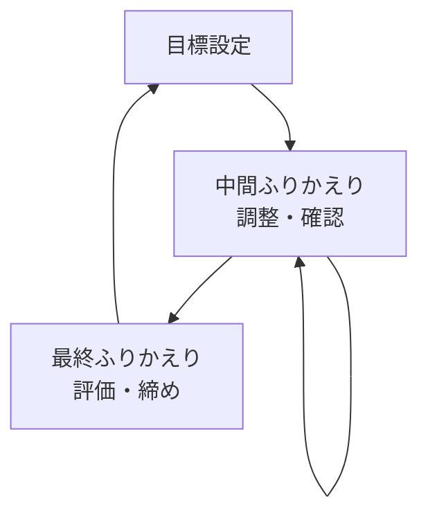
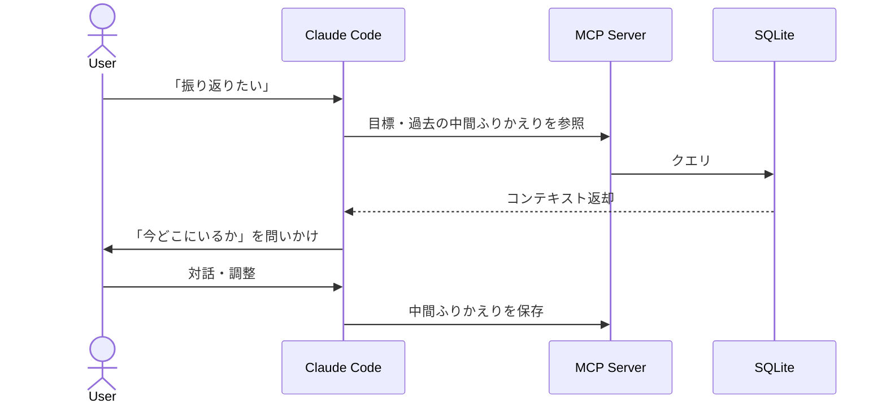
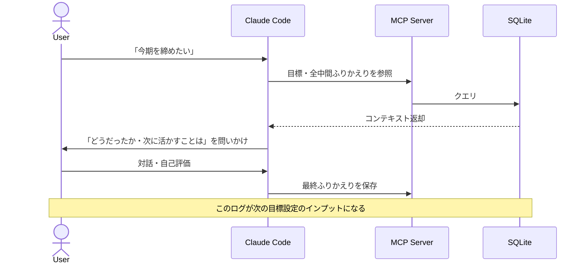
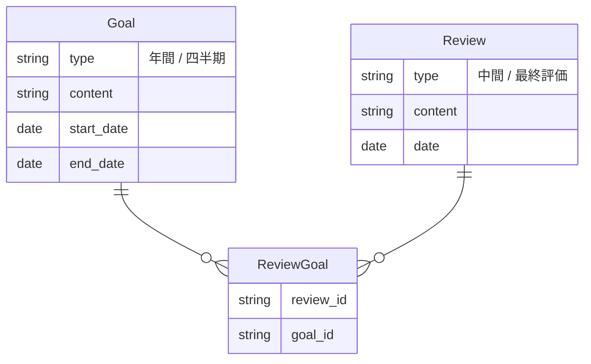

# ADR-0003: ふりかえりと目標のコア体験・分類・モデリングを定義する

- **ステータス**: 承認
- **日付**: 2026-03-14

---

## コンテキスト

ふりかえりの種類を「日次」「週次」のように頻度で分類すると、「週次でやらなければならない」という義務感が生まれる。頻度の正解が存在することになり、守れなければ挫折につながる。ふりかえりが続かない原因のひとつがこれだ。

## 検討した選択肢

### 1. 頻度で分類（日次 / 週次）

- (+) 習慣化しやすいリズムを提供できる
- (-) 「週次でやらなかった」という失敗が生まれる
- (-) ユーザーによって適切な頻度が異なる

### 2. 役割で分類（中間 / 最終）

目標サイクルの中で「何のため」にやるかで種別を定義する。

- (+) 頻度の正解が存在しないため、挫折しにくい
- (+) ユーザーが自分のペースで使える
- (-) 「いつやるか」はユーザー任せになる

## 決定

**ふりかえりの分類軸を「頻度」ではなく「役割」で定義する。**

中間ふりかえり（調整・確認）と最終ふりかえり（評価・締め）の2種類のみとする。「いつやるか」の頻度はユーザーに委ねる。Loopbackはスケジュールを強制しない。

## 根拠

- **続けられることを優先** — 頻度の強制はふりかえりを義務化し、挫折を生む
- **目的の明確化** — 「調整・確認」か「評価・締め」かという役割でふりかえりの質が変わる
- **個人差への対応** — 月次でやる人も、週次でやる人も、同じ設計で使える

---

## 目標の構造：親子関係を強制しない

### コンテキスト

目標管理ツールの多くは「年間目標 → 四半期目標」の親子関係を前提とする。しかし、会社の目標設定ツール（Notion、Workboard等）ですでに構造化されていることが多く、Loopbackに再登録する際にも同じ構造を要求するとコピペ登録ができなくなる。

### 検討した選択肢

#### 1. 年間目標 → 四半期目標の親子関係を強制する

- (+) 年間 / 四半期の対応が明確になる
- (-) 登録時に親の年間目標を先に作る必要がある
- (-) 会社ツールとは別に構造化し直す手間が生まれる
- (-) 年間目標がない（四半期のみ管理する）ユーザーには使いにくい

#### 2. 年間目標と四半期目標を独立エンティティとして扱う

- (+) コピペ登録がそのままできる
- (+) 親子関係を意識せずにシンプルに使える
- (+) 年間目標のみ、四半期目標のみのユーザーにも対応できる
- (-) 年間 / 四半期の対応関係がシステム上で追いにくくなる

### 決定

**年間目標と四半期目標を独立エンティティとして登録する。親子関係の強制はしない。**

年間目標と四半期目標はそれぞれ独立して登録できる。紐づけをしたい場合はユーザーの任意とする。Loopbackは目標の整合性チェックをしない。

### 根拠

- **コピペ登録を妨げない** — 会社のツールからそのままコピペできることを最優先にする
- **シンプルさを保つ** — 目標管理の構造化はLoopbackの責務ではない
- **ユーザーの自由度** — 年間目標を作らずに四半期目標だけ使うユーザーも想定される

---

## 決定の結果

### コアループ

目標サイクルを単位とした二重ループ構造。

### ふりかえりの種類

ふりかえりは「いつやるか」ではなく「何のためか」で分類する。
粒度（頻度）は人によって異なる。

| | 中間ふりかえり | 最終ふりかえり |
|---|---|---|
| 目的 | 調整・確認 | 評価・締め |
| タイミング | 目標サイクルの途中（粒度は人による） | 目標サイクルの終わり |
| 目標との紐づけ | 任意（複数目標をまたいでも、無関係でもよい） | 特定の目標に必須 |
| Claudeの問いかけ | 「今どこにいるか」 | 「どうだったか・次に何を活かすか」 |
| 次のアクション | また中間ふりかえりへ | 次の目標設定へ |

### ユーザーシナリオ：中間ふりかえり

### ユーザーシナリオ：最終ふりかえり

### エンティティ定義

#### 目標 (Goal)

目標サイクルの軸となるエンティティ。構造化は不要で、会社のツールからコピペして登録するだけでよい。

| 属性 | 内容 |
|---|---|
| type | 年間 / 四半期 |
| content | 自由テキスト |
| start_date | 期間開始日 |
| end_date | 期間終了日 |

- 年間目標と四半期目標は独立して登録する（親子関係の強制はしない）

#### ふりかえり (Review)

| 属性 | 内容 |
|---|---|
| type | 中間 / 最終評価 |
| content | 自由テキスト |
| date | ふりかえりを行った日 |

- 目標との紐づけは junction table（ReviewGoal）で管理する
- 中間ふりかえり：0〜n個の目標と紐づけ可能（任意）
- 最終ふりかえり：1つの目標と紐づけ必須

#### ReviewGoal（junction table）

| 属性 | 内容 |
|---|---|
| review_id | ふりかえりID |
| goal_id | 目標ID |

### ER図

### 設計方針

- **ふりかえりの分類軸は「役割」** — 頻度（日次・週次など）ではなく役割（中間/最終）で分類する
- **目標登録はシンプルに** — 構造化・タグ付けは不要。会社のツールからコピペするだけでよい
- **中間ふりかえりは自由度を高く保つ** — 目標に関係しない日常の気づきや学び、複数目標にまたがる内容も含まれてよい
- **最終ふりかえりは目標に紐づく** — 目標サイクルの締めとして、特定の目標に対して評価を記録する
