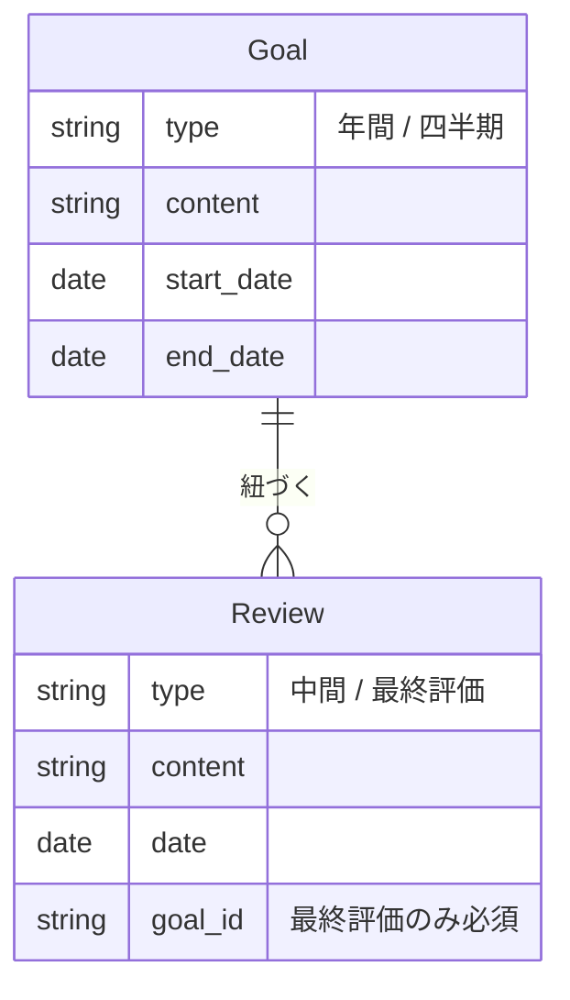

# Loopback データモデル

---

## エンティティ

### 目標 (Goal)

目標サイクルの軸となるエンティティ。構造化は不要で、会社のツールからコピペして登録するだけでよい。

| 属性 | 内容 |
|---|---|
| type | 年間 / 四半期 |
| content | 自由テキスト |
| start_date | 期間開始日 |
| end_date | 期間終了日 |

- 年間目標と四半期目標は独立して登録する（親子関係の強制はしない）

### ふりかえり (Review)

| 属性 | 内容 |
|---|---|
| type | 中間 / 最終評価 |
| content | 自由テキスト |
| date | ふりかえりを行った日 |
| goal_id | 最終評価のみ必須。中間は任意 |

---

## エンティティ関係

| | 中間ふりかえり | 最終評価ふりかえり |
|---|---|---|
| 目標との紐づけ | 任意（複数目標をまたいでもよい。無関係でもよい） | 特定の目標に必須 |

---

## 設計方針

- **ふりかえりの粒度はシステムが強制しない** — 頻度（日次・週次など）はユーザーに委ねる。Loopbackは「いつやるか」ではなく「何のためか」で種別を分類する
- **目標登録はシンプルに** — 構造化・タグ付けは不要。会社のツールからコピペするだけでよい
- **中間ふりかえりは自由度を高く保つ** — 目標に関係しない日常の気づきや学び、複数目標にまたがる内容も含まれてよい
- **最終評価ふりかえりは目標に紐づく** — 目標サイクルの締めとして、特定の目標に対して評価を記録する
