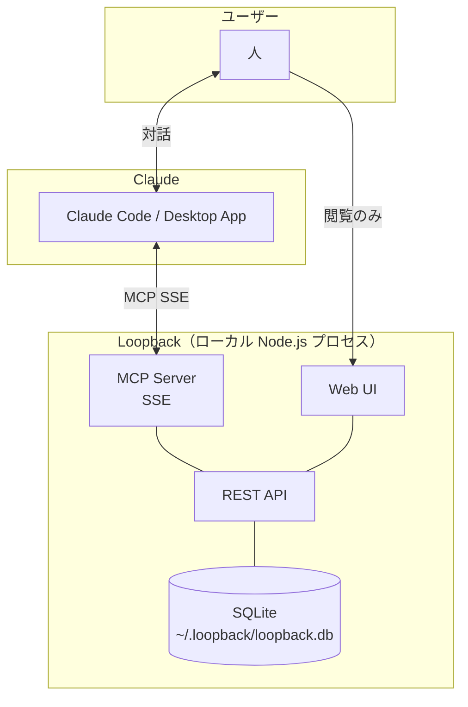

# Loopback

**Claudeと話しながらふりかえり、目標と日常のループを回すセルフマネジメントツール**

---

## 解決する課題

ふりかえりは面倒で続かない。続かないから目標と日常が乖離する。
次の目標設定のときには過去を思い出せず、的外れな目標を立ててしまう。

---

## コンセプト

**目標設定 → 高頻度ふりかえり → ログ蓄積 → 次の目標設定が的確に → …**

このループを回し続けることがLoopbackの核。

- **目標は先に立てる** — 会社のツールからコピペするだけでOK。構造化は不要
- **ふりかえりはClaudeと話しながら** — 入力フォームではなく、会話でふりかえる
- **気軽に振り返るから目標を忘れずアラインできる**
- **ログが溜まることで、次の目標設定がより適切になる**

> "振り返ることで、前に進む。"

---

## 体験の設計

**主軸はClaude（MCP経由）。UIは補助。**

|                                  | 役割                           |
| -------------------------------- | ------------------------------ |
| Claude Code / Claude Desktop App | ふりかえりの入力・対話・深掘り |
| Web UI                           | ログの閲覧・可視化（読み専）   |

Claudeが過去ログを参照しながら問いかけ、伴走する。
UIは「ふりかえりをきれいに見る場所」であり、書く場所ではない。

---

## 特徴

- **Claude前提の設計** — MCP経由でClaudeからふりかえりを記録・参照する体験を主軸に置く
- **ローカルファースト** — データはSQLiteでローカルファイルとして保持。クラウド不要
- **`loopback start` で即起動** — コマンド一発でWeb UI・DB・MCPサーバーが全て立ち上がる
- **AIはあなたのサブスクを使う** — Loopback自体はAIを持たない。使い慣れたClaudeをそのまま使う
- **外部ツール連携** — Claude Code経由でNotionなど既存の自己管理ツールとも連携可能

---

## 公開方針

- GitHubのpublicリポジトリとしてOSSで公開
- 誰でもcloneしてローカルで動かせる
- 作者自身が最大のユーザー（実験的プロジェクト）

## ターゲット

- Claude Code / Claude Desktop App を使うすべてのビジネスパーソン

---

## アーキテクチャ概要

---

## 未決事項

- MVP スコープ
- Web UIの画面構成
- CLIのコマンド体系（`loopback start` 以外）

## 決定済み事項

- **ふりかえりの種別** — 中間ふりかえり（調整・確認）と最終ふりかえり（評価・締め）の2種類。中間は複数目標をまたいでもよく目標との紐づけは任意。最終は特定の目標に必須。→ [ADR-0003](adr/0003-review-classification.md)
- **ふりかえりの粒度** — 時間軸（日次/週次）ではなく役割（中間/最終）で分類。頻度はユーザーに委ねる。「いつやらなければ」という強制をシステムが生まない設計。→ [ADR-0003](adr/0003-review-classification.md)
- **目標の構造** — 年間目標と四半期目標は独立エンティティ。親子関係の強制はしない。会社ツールからコピペするだけでよい。→ [ADR-0003](adr/0003-review-classification.md)
- **技術スタック** — TypeScript (Hono + Node.js) + React + Vite + SQLite。CLI は npm (npx) で配布。→ [ADR-0004](adr/0004-architecture.md)
- **コンテナ構成** — 単一コンテナ。API・MCP SSE・Web UIを同一プロセスで提供。→ [ADR-0004](adr/0004-architecture.md)
- **MCPツール設計** — `get_context` / `list_reviews` / `find_reviews` / `create_goal` / `save_review` の5ツール。→ [ADR-0004](adr/0004-architecture.md)
- **MCPプロンプト設計** — `review` / `review_final` / `set_goal` の3プロンプトでふりかえりの型を提供。→ [ADR-0005](adr/0005-mcp-prompts.md)
