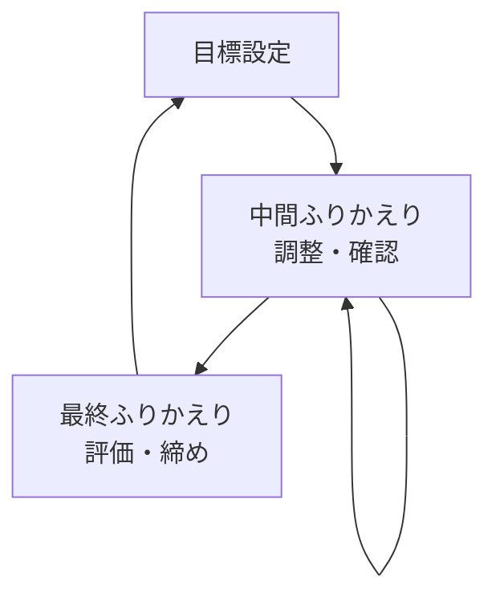
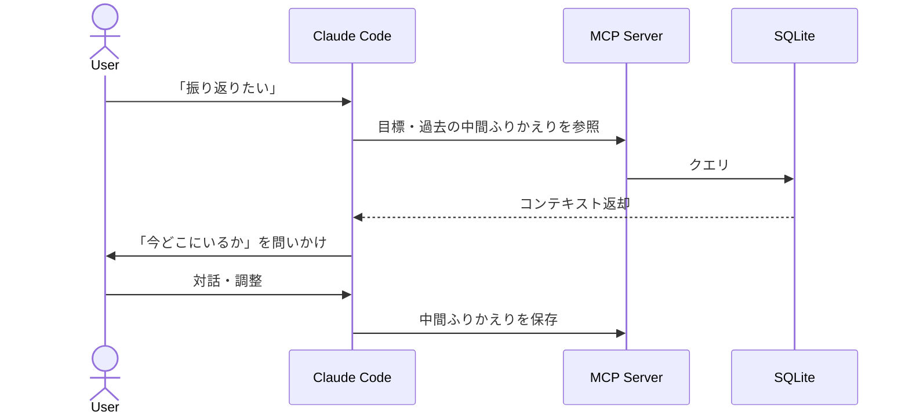
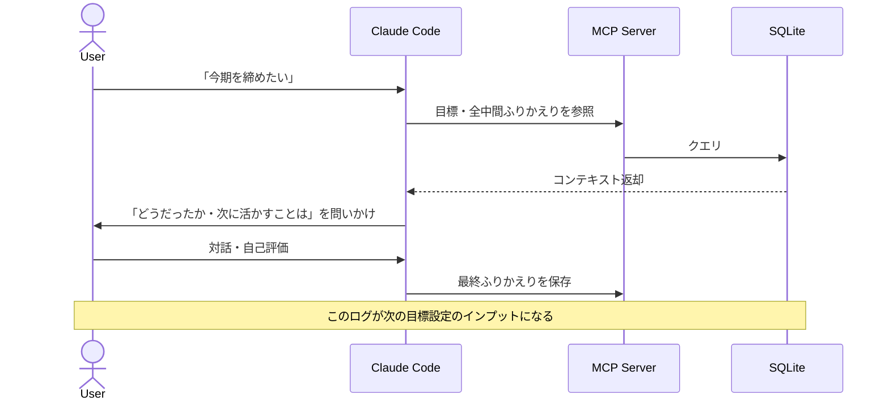
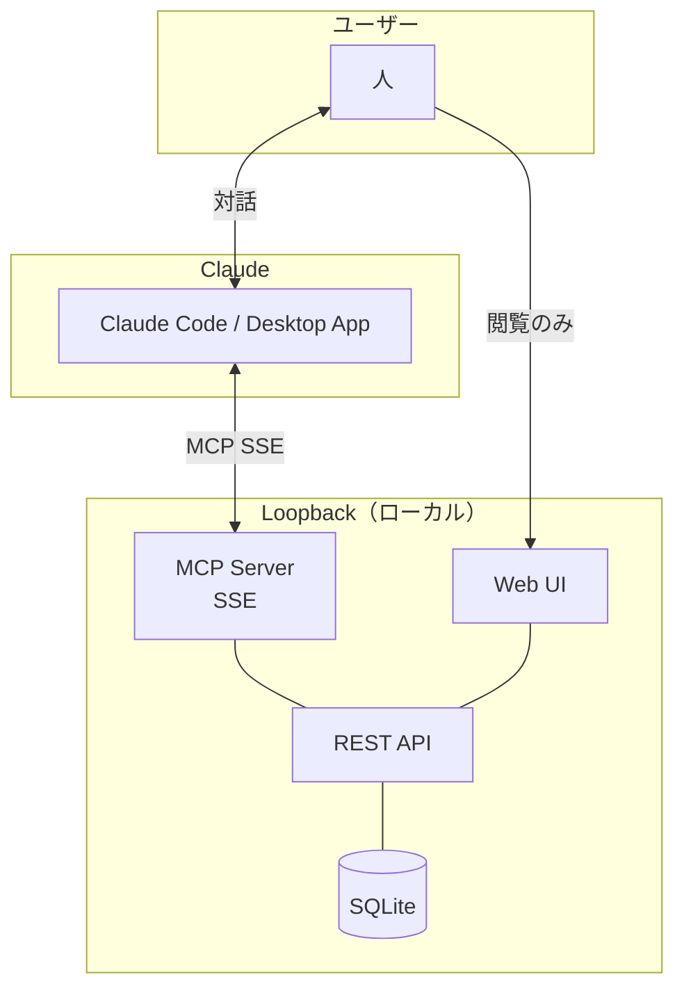

# Loopback UX Flow

---

## コアループ

目標サイクルを単位とした二重ループ構造。

---

## ふりかえりの種類

ふりかえりは「いつやるか」ではなく「何のためか」で分類する。
粒度（頻度）は人によって異なる。

| | 中間ふりかえり | 最終ふりかえり |
|---|---|---|
| 目的 | 調整・確認 | 評価・締め |
| タイミング | 目標サイクルの途中（粒度は人による） | 目標サイクルの終わり |
| 目標との紐づけ | 任意（複数目標をまたいでも、無関係でもよい） | 特定の目標に必須 |
| Claudeの問いかけ | 「今どこにいるか」 | 「どうだったか・次に何を活かすか」 |
| 次のアクション | また中間ふりかえりへ | 次の目標設定へ |

---

## ユーザーシナリオ

### 中間ふりかえり

### 最終ふりかえり

---

## システム構成

